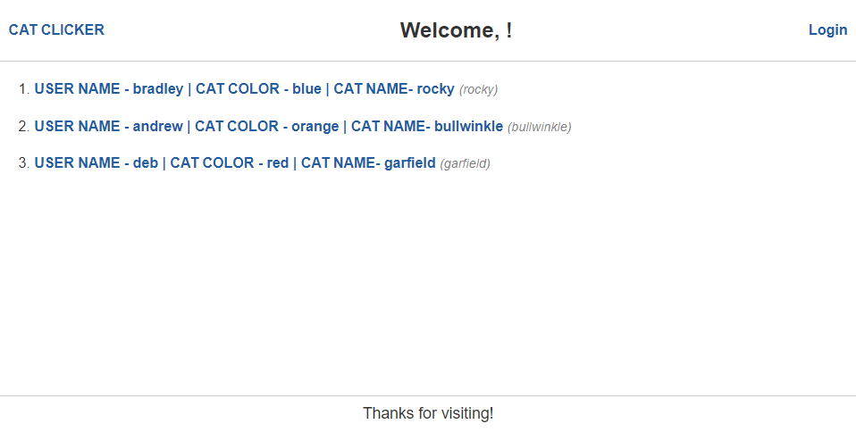
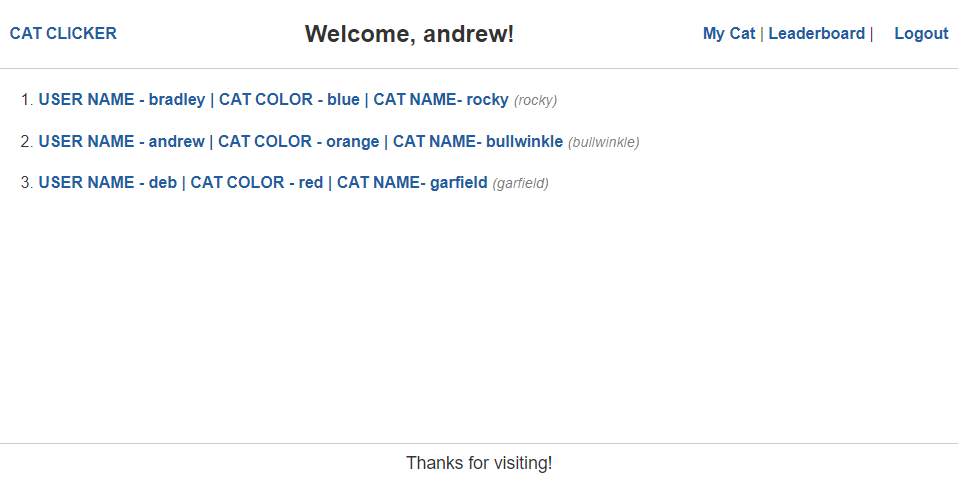

# Cat Clicker

## Description

Create a web game where you can click to "train" your cat. The higher the score, the better trained and more powerful your cat becomes! Upon loading the site you will land on the front page listing the cats created. On the home page, there is a login button to send you to the login/sign up sheet so you can get into your account and train your cat, or sign up as a new user. Upon login you will then also have options in the navigation for a leaderboard page and the "My Cat" page where you click and "train" your cat. The leaderboard will update with the total amount of clicks each cat has. 

## Technologies used

- Handlebars HTML
- CSS
- Javascript
- Node.js
- NPM Packages:
    * Express
    * Express-Session
    * Sequelize
    * dotenv
    * mysql2
    * bcrypt
    * jshint

## Webpage

NOTE: Welcome message in screenshots only shows the name of the user logged in at the time. If another user was logged in the welcome message would show their username instead.

Link: https://radiant-island-77079.herokuapp.com/

Landing Page:

Landing Page after successful login:

## Contributors

Project built by Bradley Parris, Debajit Boro, Andrew Secore, Buddy LaFluer, and Thai K.

